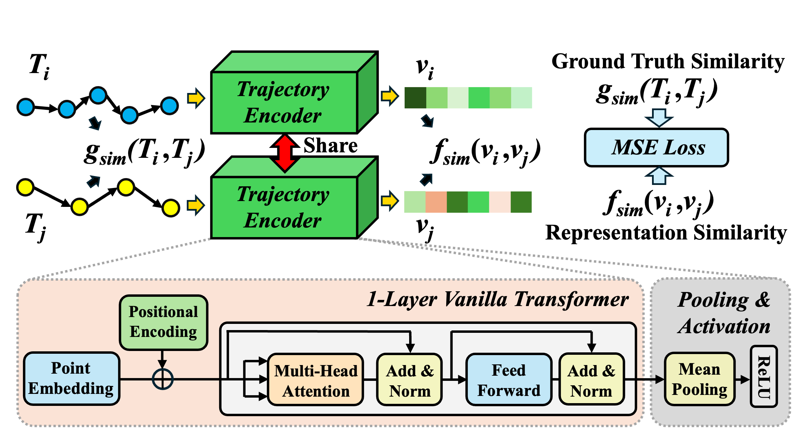

# [VLDB 2025] SIMformer: Single-Layer Vanilla Transformer Can Learn Free-Space Trajectory Similarity
<!--  -->
 </img>

## Required Packages
Make sure to install the following packages before running the experiments:
- `torchmetrics`
- `pytorch`
- `traj-dist`
- `Python 3.x`
- `wandb` (optional but highly recommended for experiment monitoring)
- `folium` (optional but highly recommended for trajectory visualization)


## 🌟 Download Processed Trajectory Data
Considering the cumbersome data processing flow, we provide processed data here for easy and quick start. 
Each dataset includes four sub-files: trajectory dataset of 10k trajectories, and corresponding DTW, Hausdorff, discrete Frechet distance matrices.
- [Porto 10k](https://drive.google.com/drive/folders/1wcLK-JYnOBwQ0XFfKAig2DXpauJaiwRJ?usp=sharing)   
- [Geolife 10k](https://drive.google.com/drive/folders/1920GXxT1jcm3FMg7bfTx4YePpUrJlvAj?usp=sharing)
- [T-Drive 10k](https://drive.google.com/drive/folders/1Mp4rx9wS4ToTiqliLiB4gPtqwJrbEpqa?usp=sharing)
- [AIS 10k](https://drive.google.com/drive/folders/1PhjiJaqGAlq8Bp-9hJIks3_XaFnpXRiX?usp=sharing)

Download the desired data and place it in the `data/dataset` directory. For example, if you want to use Porto data, move the downloaded files to `data/dataset/porto`.

*Note: If you want to preprocessing the raw data by yourself, you can find it [here](data/data_preprocessing/readme.md).

## ⚙️ Run the Experiments
Here is an example command to start an experiment with the `porto` dataset using the `Cosine` simlarity to approximate `DTW` measure:

```bash 
python main.py --dataset porto --target_measure dtw --emb_sim_metric cos 
``` 

### Parameters 
The script `main.py` accepts three groups of paras to configure the experiment:

#### Parameters for Training 
- dataset: Dataset to use (`porto`, `geolife`, `tdrive`, or `ais`, default: `porto`).
- target_measure: Similarity measure to use (`dtw`, `haus`, `fret`, default: `dtw`).
- emb_sim_metric: tailored representation function (`cos`, `euc`, or `chebyshev`, default: `euc`).
- save_best: Save the best model during training (default: `1`).
- gpu: GPU index to use (default: `0`).
- max_epoch: Maximum number of training epochs (default: `500`).
- sampling_num: Number of samples for each batch (default: `20`).
- lr: Learning rate (default: `0.0005`).
- batch_size: Batch size (default: `20`).


#### Parameters for Vanilla Transformer 
- hidden_dim: Hidden dimension size (default: `128`).
- num_layers: Number of transformer layers (default: `1`).
- n_heads: Number of attention heads (default: `16`).
- pos_encoding: Type of positional encoding (`learnable` or `fixed`, default: `learnable`).

#### Parameters for Wandb Monitoring (If you use it like me 😊)
- exp_name: Name of the experiment (default: `debug`).
- logging: Enable logging with wandb (default: `0`).
- proj_name: Wandb project name (default: `SIMformer`).


## 🎄 Additional Experimental Data and Analysis
We provide more experimental data and corresponding analysis in [this document](./additional_results/simformer_additional_results.pdf), which offers further evidence and perspectives, demonstrating the superiority of SIMformer. If you're interested, feel free to take a look! 😊
